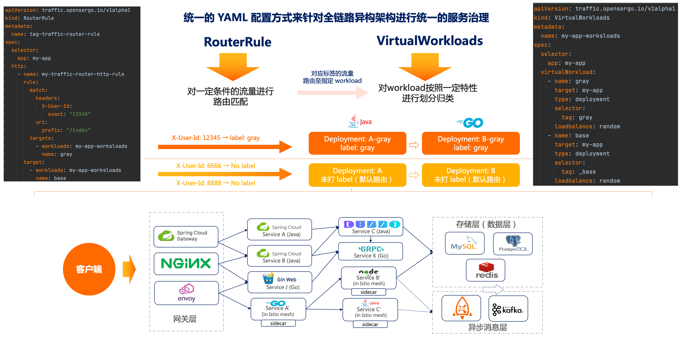

# 流量路由标准 v1alpha1

* domain: traffic
* version: v1alpha1

流量路由，顾名思义就是将具有某些属性特征的流量，路由到指定的目标。流量路由是流量治理中重要的一环，我们可以基于流量路由标准来实现各种场景，如全链路灰度、金丝雀发布、容灾路由等。

流量路由规则 (v1alpha1) 主要分为三部分：

* Workload 标签规则 (`WorkloadLabelRule`)：将某一组 workload（如 Kubernetes Deployment, Statefulset 或者一组 pod，或某个 JVM 进程，甚至是一组 DB 实例）打上对应的标签
* 流量标签规则 (`TrafficLabelRule`)：将具有某些属性特征的流量，打上对应的标签
* 按照 Workload 标签和流量标签来做匹配路由，将带有指定标签的流量路由到匹配的 workload 中



## Workload 打标

Workload 标签规则 (`WorkloadLabelRule`) 将某一组 workload（如 Kubernetes Deployment, Statefulset 或者一组 pod，或某个 JVM 进程，甚至是一组 DB、缓存实例）打上对应的标签。

对于通用的 workload 打标场景，我们可以利用 WorkloadLabelRule CRD 进行打标。特别地，对于 Kubernetes workload，我们可以通过直接在 workload 上打 label 的方式进行标签绑定，如在 Deployment 上打上 `traffic.opensergo.io/label: gray` 标签代表灰度。

一个标准的 workload 划分应该类似于:

```yaml
apiVersion: traffic.opensergo.io/v1alpha1
kind: WorkloadLabelRule
metadata:
  name: gray-sts-label-rule
spec:
  workloadLabels: ['gray']
  selector:
    app: my-app-gray
    database: 'foo_db'
```

### 微服务框架如何感知标签

在应用部署时，会通过`OPENSERGO_BOOTSTRAP_CONFIG`环境变量来制定接入信息，其value是json格式。

value中的`OPENSERGO_LABEL`的值即为workload的标签。

为了方便通过注册中心方式的标签路由，OpenSergo规定，微服务节点在注册中心中，应该带上注册元信息`OpenSergo-Label: <label值>`，方便流量打标和匹配。

## 流量打标

流量标签规则 (`TrafficLabelRule`) 将具有某些属性特征的流量，打上对应的标签。示例 YAML：

```yaml
apiVersion: traffic.opensergo.io/v1alpha1
kind: TrafficLabelRule
metadata:
  name: my-traffic-label-rule
  labels:
    app: my-app
spec:
  selector:
    app: my-app
  trafficLabel: gray
  match:
  - condition: "=="    # 匹配表达式
    type: header       # 匹配属性类型
    key: 'X-User-Id'   # 参数名
    value: 12345       # 参数值
  - condition: "=="
    value: "/index"
    type: path
```

### 流量标的传递

OpenSergo标准中，标签的传递通过OpenTelemetry中key为`OpenSergo-Label`的`Baggage`来传递。

## 按照标签匹配进行路由

在具体的路由过程中，接入了 OpenSergo 的微服务框架、Service Mesh 的 proxy 中，只要实现了 OpenSergo 标准并进行上述规则配置，那么就能识别流量的标签和 workload 的标签。

带 label 的流量就会流转到对应 label 的实例分组中；如果集群中没有该 label 的实例分组（即没有 workload 带有这个标签），则默认 fallback 到没有标签的实例上。

后续版本标准将提供未匹配流量的兜底配置方式。
